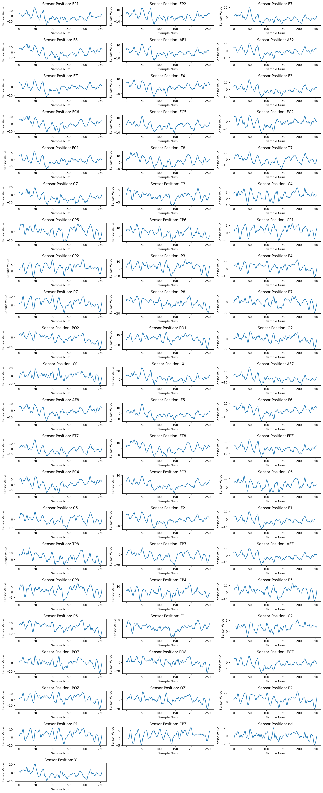
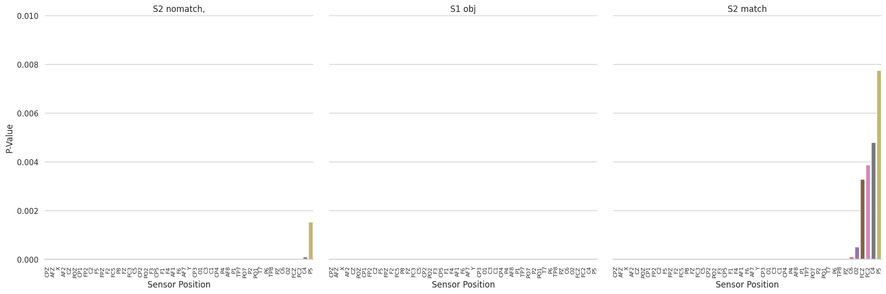
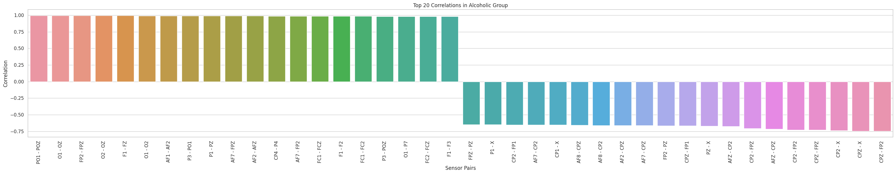
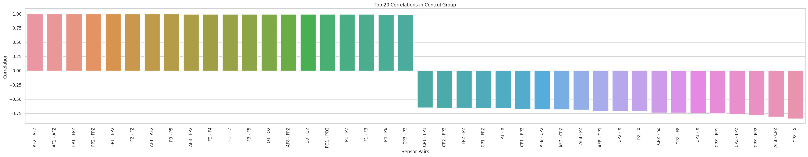

# EEG Data Analysis for Alcoholism

## About the Dataset

This dataset is a valuable resource originating from a comprehensive study that delves into the EEG correlates associated with a genetic predisposition to alcoholism. The dataset comprises intricate measurements collected from 64 electrodes meticulously positioned on subjects' scalps. The data was sampled at a rate of 256 Hz, with each sample representing a 3.9-millisecond epoch duration over the course of 1 second. Subjects were methodically categorized into alcoholic and control groups, with each individual being exposed to specific stimuli - either a single stimulus (S1) or a pair of stimuli (S1 and S2) meticulously selected from the renowned 1980 Snodgrass and Vanderwart picture set. In trials involving dual stimuli, S1 and S2 could either be identical (matched condition) or distinct (non-matched condition).

## Attribute Information

Each trial is encapsulated within its individual file and adheres to this structured format:

- **Trial Number**: Unique identifier for each trial.
- **Sensor Position**: The specific position on the scalp where the electrode was placed.
- **Sample Number (0-255)**: Numerical identifier denoting the sample within the epoch (ranging from 0 to 255).
- **Sensor Value (microvolts)**: EEG sensor reading in microvolts.
- **Subject Identifier (Alcoholic: `a` or Control: `c`)**: Categorization of subjects into alcoholic (`a`) or control (`c`) groups.
- **Matching Condition (S1 object, S2 matched, S2 non-matched)**: Specification of the matching condition, indicating whether S1 object, S2 matched, or S2 non-matched stimuli were used.
- **Subject Name (serial code)**: Unique serial code assigned to each subject.
- **Time (inverse of sample number in seconds)**: Time variable, representing the inverse of the sample number in seconds.

## Dataset Source

This dataset is publicly accessible and free to use without any constraints. Acknowledgments for this dataset should be directed towards Henri Begleiter at the Neurodynamics Laboratory, State University of New York Health Center at Brooklyn.

**Dataset Link:** [EEG Database](https://archive.ics.uci.edu/ml/datasets/eeg+database)

## Project Overview

In our EEG Data Analysis for Alcoholism project, we employ techniques to gain profound insights into brain activity patterns related to alcoholism. Our project focuses on the visualization, analysis, and interpretation of EEG sensor data, providing a comprehensive understanding of neural responses in specific conditions.

### Key Analysis

#### Visualize Filtered EEG Sensor Data (graph_wave function)
This function serves as a pivotal tool for visualizing EEG sensor data. By applying dynamic filters such as matching conditions, subject names, identifiers, and trial numbers, it extracts targeted data from the input DataFrame. The function then generates individual subplots, each representing a unique sensor position. This visual representation offers a clear insight into EEG sensor values, enhancing our understanding of brain activity under diverse circumstances.

<div align="center">
  
</div>


#### Rank Significant Differences in Sensor Data (identify_significant_differences function)
This function plays a vital role in identifying significant differences in firing patterns between alcoholic and control groups. By conducting Mann-Whitney U tests for each sensor position under various matching conditions, it ranks the results based on p-values. The visualization aspect highlights sensors exhibiting substantial disparities in activity between the two groups. This in-depth analysis provides critical information about brain regions associated with alcoholism.

<div align="center">
  
</div>


#### Correlation per Sensor Pair for Matching Condition (calculate_correlations function)
In this function, we explore correlated activity between different brain regions when exposed to specific stimuli. By calculating correlations between sensor positions and implementing a correlation threshold, the function identifies regions that exhibit synchronized responses to particular stimuli. This analysis sheds light on the interconnectedness of brain areas, offering valuable insights into neural responses under varying conditions.

#### Top N Correlations Visualization (visualize_top_correlations function)
This function focuses on unveiling the strongest positive and negative correlations between pairs of EEG sensors. By visualizing these correlations for specific subject identifiers ('a' or 'c'), it provides a detailed understanding of interrelated activities within different brain regions. This visualization aids in deciphering neural connectivity patterns, contributing significantly to our comprehension of the brain's functional networks.

<div align="center">
  
</div>

<div align="center">
  
</div>


#### Train and Evaluate Classifier (train_and_evaluate_classifier function)
An integral part of our project involves the application of machine learning techniques. This function preprocesses EEG sensor data, standardizes features, applies dimensionality reduction through PCA, and trains a Support Vector Machine (SVM) classifier. The classifier's performance is rigorously evaluated, and feature importance is assessed. Through this process, we identify crucial features contributing to subject classification under diverse matching conditions, enhancing our ability to discern patterns within EEG data.

| S2 match | ACC = 63.44%   |  S1 obj        | ACC = 62.87%   |   S2 no match  | ACC = 64.69%   |
|----------|----------------|----------------|----------------|----------------|----------------|
| Sensor   | Importance     | Sensor         | Importance     | Sensor         | Importance     |
| -------- | -------------- | -------------- | -------------- | -------------- | -------------- |
| F5       | 0.8130         | C3             | 0.4434         | C4             | 0.7192         |
| F2       | 0.6120         | C5             | 0.2502         | CP5            | 0.5276         |
| CP3      | 0.3289         | CP5            | 0.1940         | F1             | 0.4628         |
| CP6      | 0.2831         | C1             | 0.1612         | F2             | 0.4515         |
| F3       | 0.2732         | CP1            | 0.1284         | C5             | 0.3881         |
| C1       | 0.2371         | F4             | 0.1223         | CZ             | 0.3087         |
| CZ       | 0.1619         | AF8            | 0.0458         | CP6            | 0.2863         |
| AFZ      | 0.1512         | C4             | 0.0295         | C6             | 0.1804         |
| AF1      | 0.0006         | AF1            | 0.0050         | C1             | 0.1136         |
| F4       | -0.0194        | C6             | -0.0423        | AFZ            | 0.0913         |
| AF2      | -0.0231        | F1             | -0.0810        | CP4            | 0.0826         |
| AF8      | -0.0338        | AF2            | -0.1068        | C3             | 0.0820         |
| AF7      | -0.0571        | CP2            | -0.1101        | AF7            | 0.0311         |
| C2       | -0.1824        | CPZ            | -0.1183        | AF2            | -0.0174        |
| C6       | -0.1840        | AF7            | -0.1215        | AF1            | -0.0331        |
| C3       | -0.2666        | C2             | -0.1530        | F3             | -0.0616        |
| C4       | -0.3200        | CP6            | -0.2109        | CP2            | -0.1238        |
| CPZ      | -0.3203        | AFZ            | -0.2236        | AF8            | -0.1464        |
| F1       | -0.3432        | F3             | -0.2575        | CPZ            | -0.2087        |
| CP1      | -0.3681        | CP3            | -0.3386        | C2             | -0.2484        |
| CP4      | -0.3835        | F2             | -0.4193        | CP1            | -0.3124        |
| CP2      | -0.3981        | CZ             | -0.4565        | CP3            | -0.4327        |
| C5       | -0.4629        | F5             | -0.4622        | F4             | -0.5520        |
| CP5      | -0.5781        | CP4            | -0.6741        |                |                |


For detailed usage instructions, examples, and a comprehensive exploration of our analyses, please refer to the accompanying Jupyter Notebook (analysis.ipynb). Our project not only advances the understanding of alcoholism-related brain activity but also demonstrates the power of data-driven insights in the realm of neuroscience.


## File Descriptions

- **`EEG_Alcohol.ipynb`**: Jupyter Notebook file containing the code for data analysis.
- **`LICENSE`**: Documentation outlining the licensing information for the project.
- **`README.md`**: This file, providing an overview of the project, dataset information, and instructions.

## Getting Started

1. **Clone the Repository:**
   ```bash
   git clone https://github.com/your-username/eeg-data-analysis.git
   cd eeg-data-analysis
